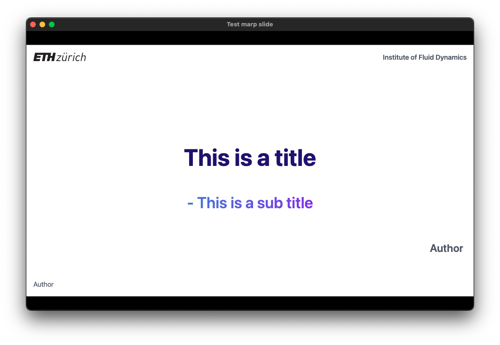
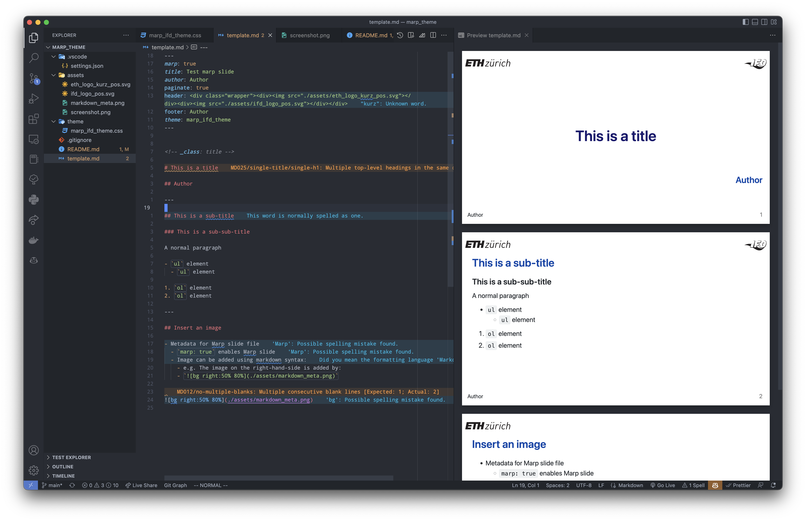

# Marp ETHZ-IFD theme

ETHZ-IFD theme for the [Marp](https://marp.app) presentation.

The theme inherits from the default Marp theme, however logos have been added to the header, as well as a title page.

It is recommended that you use VScode for editing.

## How to use

Install Marp tools

```bash
brew install marp-cli
# or
npm i @marp-team/marp-cli
```

And run `marp-cli` using `-p` and `-s` flag to enable preview and server.

```bash
marp-cli -p -s ./
```

Alternatively, you can use VScode for preview and editing.

## Demo

Using `marp-cli`:



Using VScode:

