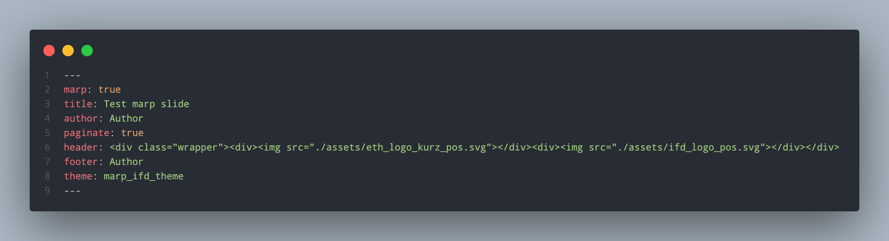

<!-- _class: title -->

# This is a title

## Author

---

## This is a sub-title

### This is a sub-sub-title

A normal paragraph

- `ul` element
  - `ul` element

1. `ol` element
2. `ol` element

---

## Insert an image

- Metadata for Marp slide file
  - `marp: true` enables Marp slide
  - Image can be added using markdown syntax:
    - e.g. The image on the right-hand-side is added by:
    - ``

